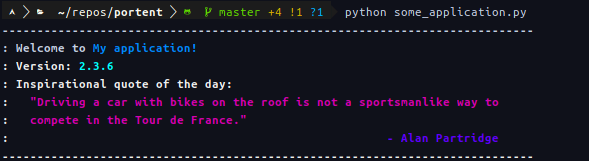

# portent
Python package providing horrifying welcome messages for your application.

Simply place something like the following in your top-level application
file, and portent will display a helpful, motivational welcome message
once per session.

```python
import portent
portent.welcome(name='My application', version='2.3.6')
```



Pass the theme argument to the `welcome` function to use a different
greeter:
- basic
- finance

